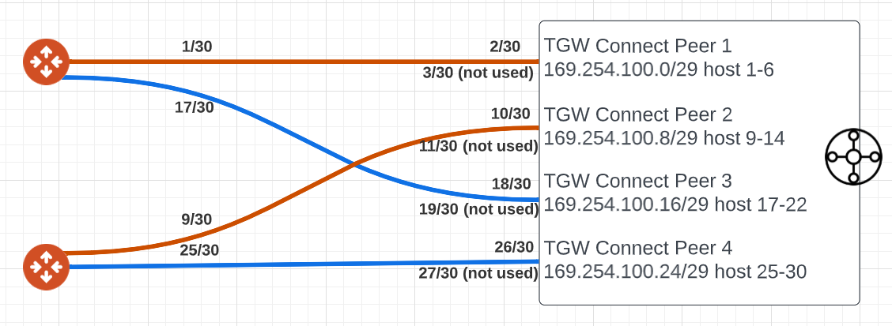

# terraform-aviatrix-bgp-over-gre-between-new-tgw-avx-transit

This module builds Aviatrix Transit Gateways and TGW in the same region, then peer them using BGP over GRE.

AWS TGW is looking to use /29 block to build two GRE tunnels to one target outer address. It will first IP for remote peer inside IP, and assign 2nd and 3rd IP for it's own inside IP.
Aviatrix Transit Gateway is looking to use /30 block to build one GRE tunnel per Aviatrix Transit Gateway to remote target outer address
  

From example above, from TGW it need to build 4 peers to Aviatrix Transit Gateways.
Each peer need it's /29 range, hence we've got 169.254.100.0/29, 169.254.100.8/29, 169.254.100.16/29, 169.254.100.24/29 for these four peers.
For each /29 range, we pick first IP for Aviatrix Transit side inner IP and second IP for TGW side inner IP, and use /30 on Aviatrix Transit Gateway Site to Cloud (S2C) connections.

Since Aviatrix build S2C from both it's gateways, in the above diagram. Orange lines will be one S2C connection and Blue lines will be another S2C connection.

### For Aviatrix Orange S2C connection:
* Local tunnel IP: 169.254.100.1,169.254.100.9
* Remote tunnel IP: 169.254.100.2,169.254.100.10

### For Aviatrix Blue S2C connection:
* Local tunnel IP: 169.254.100.17,169.254.100.25
* Remote tunnel IP: 169.254.100.18,169.254.100.26

### For AWS TGW Peer 1
* BGP Inside CIDR: 169.254.100.0/29

### For AWS TGW Peer 2
* BGP Inside CIDR: 169.254.100.8/29

### For AWS TGW Peer 3
* BGP Inside CIDR: 169.254.100.16/29

### For AWS TGW Peer 4
* BGP Inside CIDR: 169.254.100.19/29